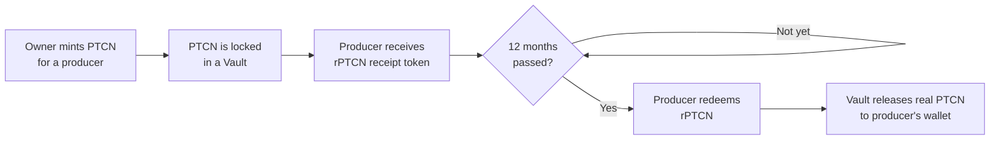

# PetroCoin (PTCN) — A Plain-English Guide

This guide explains how PetroCoin works for people who have little or no background in blockchain or crypto. If you just received PTCN, or a "vault receipt" token, and want to understand what it is and what to do with it, start here.

No prior crypto knowledge is assumed — unfamiliar terms are explained the first time they're used, and there's a [glossary](#glossary) at the end.

---

## 1. What is PetroCoin?

**PetroCoin (ticker: `PTCN`)** is a digital token where every unit issued is backed by a real, physical asset — things like oil & gas royalties, working interests, power generation projects, precious metals, or other tangible holdings.

Rather than PTCN just being a number in a spreadsheet, each new batch of tokens is created ("minted") on the Ethereum blockchain — a shared, public record-keeping system that anyone can independently check. That public record is what lets you (or anyone else) verify that new tokens aren't being created out of thin air without a corresponding asset behind them.

## 2. How do you know each token is backed by something real?

Two things work together here:

**a) Every mint is publicly recorded on-chain, with the asset details attached.**

Whenever new PTCN is issued to an asset producer, the smart contract publishes a permanent, tamper-proof record called an **event**. Think of it like a receipt that gets printed into a public ledger that nobody — including PetroCoin itself — can quietly edit or delete afterward.

That event (called `TokenDistribution` in the contract) records three things together, at the moment of minting:

| Field | What it tells you |
|---|---|
| Tokens minted | How much PTCN was created in this batch |
| Estimated value | The appraised value of the underlying asset backing this batch |
| Asset category | What kind of asset it is (e.g. Royalties, Working Interest, Power Generation, Precious Metals, Minerals, and others) |

Because the token amount and the estimated value are published together, in the same permanent record, anyone can look at the history of mints and see the implied backing per token — it's not just a claim made in a marketing document, it's written into the same public ledger the tokens themselves live on. The same happens in reverse when tokens are redeemed and removed from circulation (a `TokenRedemption` event records the amount burned and the value redeemed).

**b) Regular independent financial audits.**

On top of the on-chain record, PetroCoin's reserves and underlying assets are checked periodically through independent financial audits. Where the blockchain event tells you *what was recorded at mint time*, the audit process confirms that the underlying assets backing those records genuinely exist and are properly valued — the two are complementary, not a substitute for one another.

## 3. The 12-month hold on producer mints

When new PTCN is minted for an asset producer (the party contributing the underlying real-world asset), it is **not** immediately transferable. It is locked up for **12 months** from the date it was minted.

This hold period exists so that newly issued tokens can't be dumped on the market the moment they're created — it gives time for the asset backing to be properly established and verified before those tokens can move freely.

You don't need to do anything to "start" this hold — it's built into the smart contract and begins automatically at the moment of minting.

## 4. Vaults and receipt tokens: your claim ticket

Here's the part that surprises most newcomers: when producer tokens are minted, the real PTCN doesn't go straight into the producer's wallet. Instead:

1. The PTCN is placed into a **vault** — a dedicated smart contract that holds it securely until the 12-month hold ends.
2. The producer immediately receives a **receipt token** in their wallet instead. This is a normal-looking token (it shows up in your wallet just like PTCN does), but it represents a *claim* on the PTCN sitting in the vault — like a coat-check ticket, not the coat itself.

Each receipt token is named after its unlock date, for example **`rPTCN_1785600000`** (the number is the unlock date, expressed as a timestamp). If you receive tokens from multiple mints at different times, you'll have a separate receipt token for each vault, each with its own unlock date.

Holding the receipt token doesn't let you spend PTCN yet — but it does prove, on-chain, exactly how much PTCN you're entitled to and exactly when you'll be able to claim it.

## 5. Redeeming your receipt token for real PTCN

Once the unlock date on your receipt token has passed, you can exchange it for the real PTCN sitting in your vault. This is called **releasing** the vault.

- You'll need to trigger the release yourself (or through the PetroCoin platform, if one is provided to you) once the unlock date has passed — it doesn't happen automatically.
- The redemption is **1-for-1**: your receipt tokens are permanently destroyed ("burned") in the exact amount that PTCN is sent to your wallet.
- Only the wallet holding the receipt token (or the contract owner, in exceptional cases) can trigger the release for that vault — nobody else can claim your tokens.

If you're using a PetroCoin dashboard or app, releasing your vault should be a single button once the unlock date has passed. If you're interacting with the contract directly, this corresponds to calling `releaseVaultTokens` with your vault's ID number on the `VaultFactoryFacet`, which can be done through a block explorer like Etherscan once connected to your wallet — the platform you received your tokens from can give you the exact vault ID and contract address to use.

## 6. Adding PTCN and receipt tokens to your wallet

Tokens like PTCN and rPTCN often don't show up automatically in a wallet the way ETH does — you usually need to "import" or "add" them manually the first time, using the token's **contract address** (a unique on-chain identifier for that specific token, not a wallet address). Once added, it'll show up automatically from then on.

You'll need three pieces of information to add a token:

- **Contract address** — for PTCN, this is the PetroCoin diamond contract address; for a receipt token, it's the specific vault address for that mint (get this from whoever issued your tokens, or from the vault lookup tools on the contract).
- **Symbol** — `PTCN` for PetroCoin, or `rPTCN_<unlock-date>` for a receipt token.
- **Decimals** — `6` for both PTCN and receipt tokens. (This is a technical detail some wallets ask for; if you enter the wrong number here, your balance will display incorrectly, even though the actual amount you hold is unaffected.)

### MetaMask

1. Open MetaMask and make sure you're connected to the **Ethereum Mainnet** network (top of the app).
2. Scroll down and click **Import tokens** (or, on mobile, tap the **Tokens** tab, then **Import tokens**).
3. Select **Custom Token**.
4. Paste the **contract address** into the "Token Contract Address" field — the Symbol and Decimals fields should fill in automatically. If they don't, enter the symbol and set decimals to `6` manually.
5. Click **Add Custom Token**, then **Import Tokens** to confirm.

Your PTCN or rPTCN balance will now appear on your MetaMask assets list.

### Trust Wallet

1. Open Trust Wallet and tap the search/plus icon at the top right of your assets list.
2. Tap **Add Custom Token** at the bottom of the search screen.
3. Set the network to **Ethereum**.
4. Paste the **contract address** — the name, symbol, and decimals should auto-fill. Confirm decimals is set to `6`.
5. Tap **Done** (or **Save**) to add it to your asset list.

> Other wallets (Coinbase Wallet, Rainbow, etc.) follow the same basic pattern: look for an "Import Token," "Add Custom Token," or "Add Asset" option, make sure the network is set to Ethereum, and enter the contract address.

## 7. Staying safe

A few basics that apply to any wallet, not just PetroCoin:

- **Never share your seed phrase or private key with anyone**, including anyone claiming to be PetroCoin support. Nobody legitimate will ever ask for it. Whoever has your seed phrase has full control of your funds, permanently.
- **Double-check contract addresses** before importing a token or interacting with a contract directly. Get addresses from a trusted source (the platform or person who issued your tokens), not from search results or unsolicited messages.
- **A wallet address is not a secret** — it's fine to share your wallet address with others so they can send you tokens. It's the seed phrase / private key that must stay private.
- **Transactions cost "gas"** (a small fee paid in ETH) to process on Ethereum, including releasing tokens from a vault. Make sure your wallet holds a small amount of ETH to cover this before trying to redeem.

## Glossary

- **Wallet** — an app (like MetaMask) or device that holds your crypto assets and lets you sign transactions. Identified by a public **wallet address**.
- **Contract address** — the unique on-chain identifier for a specific token or smart contract. Different from a wallet address.
- **Smart contract** — a program that runs on the blockchain exactly as written, without a central operator able to change the outcome after the fact.
- **Mint** — creating new tokens.
- **Burn** — permanently destroying tokens, removing them from circulation.
- **Event** — a permanent, public log entry a smart contract writes when something happens (e.g. a mint or redemption), viewable by anyone.
- **Vault / TokenTimelock** — a smart contract that holds tokens and won't release them until a set unlock date has passed.
- **Receipt token (rPTCN)** — a token representing your claim on PTCN that's currently locked in a vault; redeemable 1-for-1 for real PTCN once the unlock date passes.
- **Decimals** — how finely a token can be subdivided for display purposes; PTCN and rPTCN both use 6 decimals.
- **Gas** — the small fee (paid in ETH) required to process a transaction on Ethereum.
- **Seed phrase / private key** — the secret that grants full control over a wallet's contents. Never share it.
